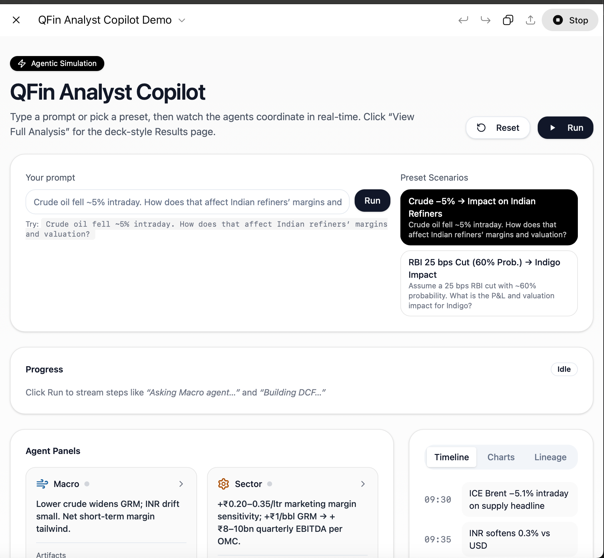
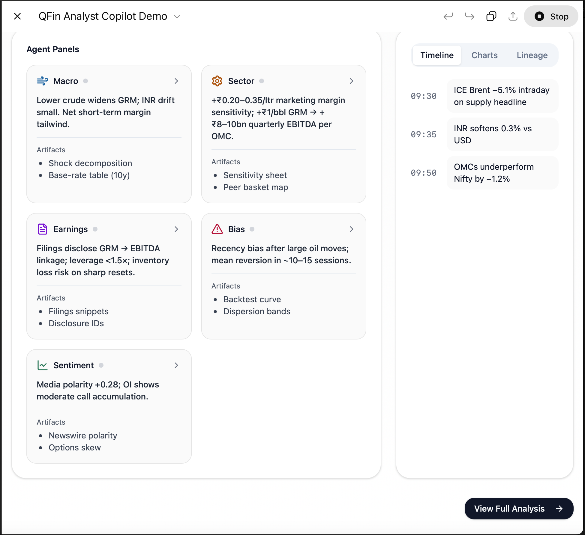
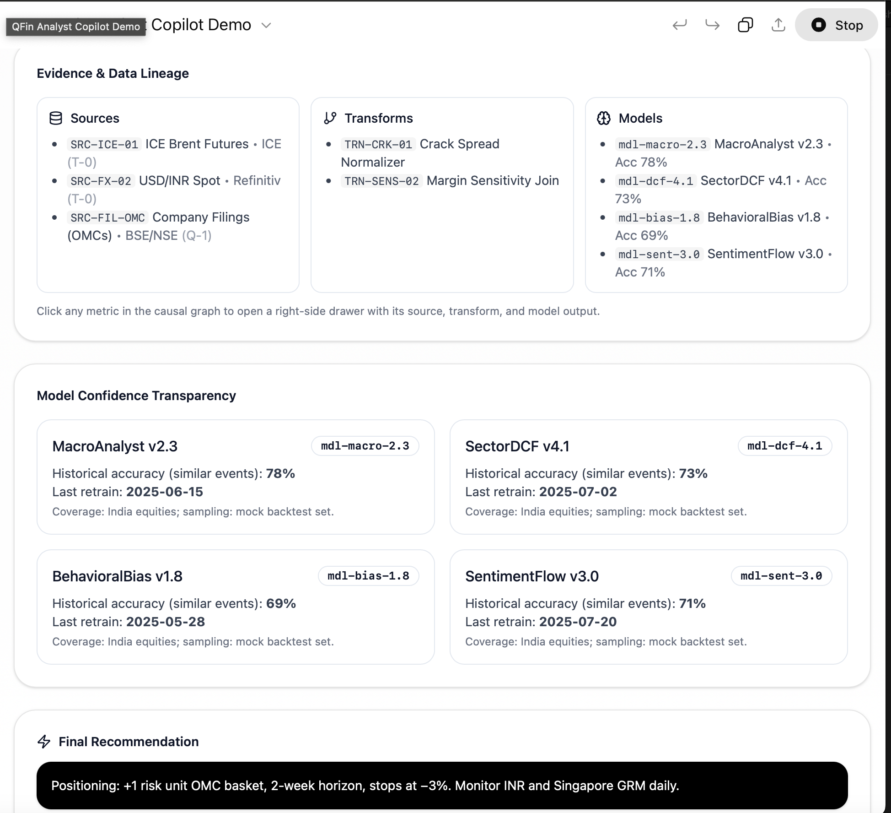

# QFin Analyst Copilot – Showcase Edition
**AI-powered investment research for emerging markets**

---

## Overview
QFin Analyst Copilot is an AI-augmented research tool designed to help asset managers navigate the fragmented and complex data environments of emerging markets.

By combining multi-agent workflows, LLMs, and quantitative models, QFin transforms raw, unstructured information into clear, actionable investment intelligence.

This showcase branch demonstrates the architecture, workflows, and capabilities using synthetic market data and mock APIs.  
The production system integrates with proprietary datasets, which are not included here.

---

## Key Features
- **Multi-Agent Architecture** – Dedicated agents for market data ingestion, earnings parsing, macroeconomic analysis, and corporate event processing.
- **Retrieval-Augmented Generation (RAG)** – Enhances LLM reasoning with context-rich financial datasets.
- **Quantitative Impact Engine** – Models the estimated earnings or sectoral impact of key market events.
- **Custom Data Pipelines** – Dockerized ingestion & processing stack for news, filings, and macro data.
- **Vector Database Search** – Fast retrieval of relevant market intelligence.
- **Modular & Extensible** – Easily add new data sources, analytics, and model layers.

---

## Tech Stack
**Languages:** Python, SQL  
**Frameworks:** LangChain, TensorFlow, PyTorch (lightweight showcase models)  
**Databases:** PostgreSQL, FAISS/ChromaDB (vector search)  
**Deployment:** Docker, Docker Compose  
**Visualization:** Apache Superset (mock dashboards in this branch)

---

## Architecture
```text
┌────────────────────┐
│   Data Sources      │  ← (Synthetic APIs, mock filings, news feeds)
└─────────┬──────────┘
          │
          ▼
┌────────────────────┐
│ Ingestion Agents    │  (Market, Earnings, Macro, Corporate)
└─────────┬──────────┘
          │
          ▼
┌────────────────────┐
│   Vector DB / RAG   │
└─────────┬──────────┘
          │
          ▼
┌────────────────────┐
│ Quant Impact Engine │
└─────────┬──────────┘
          │
          ▼
┌────────────────────┐
│ Analyst Dashboard   │
└────────────────────┘

## Screenshots
<p align="center">
  
  
  
</p>

---

## Disclaimer
This is a public showcase version of QFin Analyst Copilot.  
It uses synthetic and publicly available data only.  
The production system includes proprietary datasets, models, and integrations that are not part of this repository.
